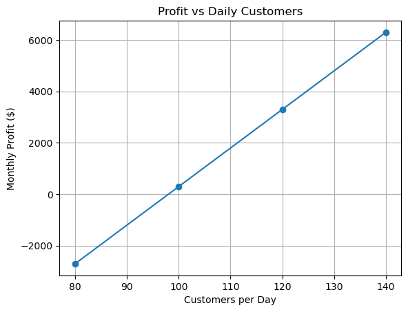

# Coffee Shop Profitability Analysis: A Business Case Study

This project analyzes whether a small coffee shop can operate profitably under realistic business assumptions. Using Python, it estimates revenue, expenses, monthly profit, and break-even customer volume to evaluate the shop’s financial sustainability.

## Objective
The goal of this analysis is to determine whether the coffee shop is financially viable and to identify the key factors that most affect profitability, such as customer demand, pricing, and operating costs.

## Business Assumptions
- Coffee price: $5
- Customers per day: 120
- Days open per month: 30

## Results
- Monthly Revenue: $18,000
- Monthly Expenses: $14,700
- Monthly Profit: $3,300
- Break-even customers per day: ~98

## Key Insights

- The coffee shop requires approximately **98 customers per day** to break even.  
- At the current estimate of 120 customers per day, the business generates a profit of $3,300 per month, indicating relatively **tight profit margins**.  
- This suggests the business is **highly sensitive to changes in customer demand**, where even a small decrease in daily customers could eliminate profitability.  
- The model highlights that maintaining consistent customer traffic is critical for financial sustainability.

## Scenario Analysis

To better understand the business's financial sensitivity, different scenarios were tested by adjusting customer volume and pricing.

### Customer Volume Impact

- At 80 customers/day → the business operates at a loss  
- At 100 customers/day → the business is near break-even  
- At 140 customers/day → profitability increases significantly  

### Pricing Impact

- At $4 per coffee → profit decreases substantially  
- At $5 per coffee → current baseline profit  
- At $6 per coffee → profit increases significantly  

These scenarios show that the business is highly dependent on both customer demand and pricing strategy.

## Business Recommendations

Based on the analysis and scenario testing, the following recommendations can improve the coffee shop’s financial performance:

- **Increase average order value** by offering add-ons such as pastries, snacks, or combo deals.
- **Maintain consistent customer traffic** above the break-even level (~98 customers/day) through marketing, promotions, or loyalty programs.
- **Evaluate pricing strategy**, as even a small increase in price significantly improves profitability.
- **Monitor and control operating costs**, especially variable costs like supplies and labor, to protect profit margins.
- **Diversify revenue streams**, such as offering seasonal drinks or expanding product offerings.

These recommendations highlight how small operational and strategic changes can significantly impact profitability.
  
## Tools Used
- Python
- Jupyter Notebook
- Matplotlib

## Data Visualization

This section presents visual representations of the coffee shop’s financial performance and how profitability changes with customer demand.

### Financial Performance

### Interpretation

The chart shows that the coffee shop generates strong revenue relative to its operating costs, resulting in a positive monthly profit of approximately $3,300. However, the relatively small gap between revenue and expenses indicates that profit margins are not very large, reinforcing the earlier insight that the business is sensitive to changes in customer demand and costs.

### Profit vs Customers

### Interpretation

The chart shows a clear relationship between customer volume and profitability. As daily customers increase, monthly profit rises significantly, while lower customer levels quickly result in losses. The break-even point occurs at approximately 98 customers per day, where profit transitions from negative to positive. This reinforces that maintaining sufficient customer traffic is critical for sustaining profitability.

## Conclusion

This analysis shows that the coffee shop is profitable under the current assumptions, generating approximately $3,300 in monthly profit. However, the business operates with relatively tight margins and is highly sensitive to changes in customer demand and pricing.

The break-even analysis and scenario testing highlight that even small decreases in daily customers or pricing can significantly impact profitability. As a result, maintaining consistent customer traffic and carefully managing pricing and costs are critical for long-term financial sustainability.

Overall, the model demonstrates that while the business is viable, strategic decisions around demand generation, pricing, and cost control are essential to ensure stable and scalable profitability.
